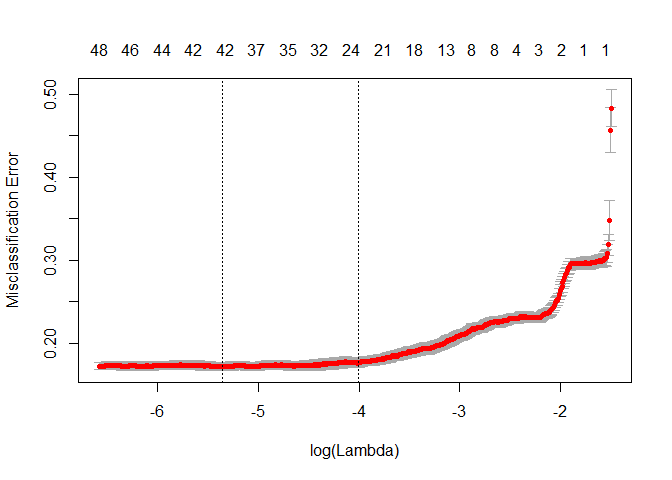
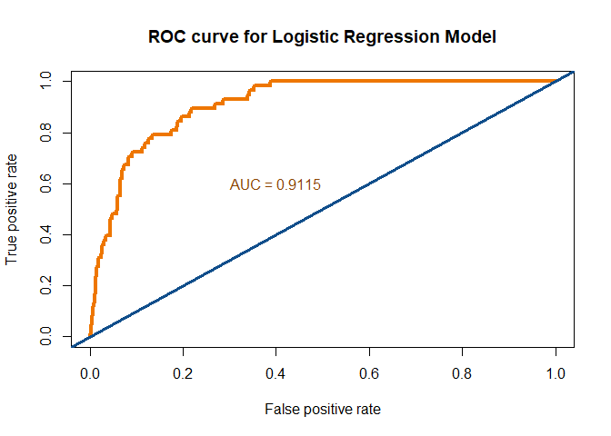
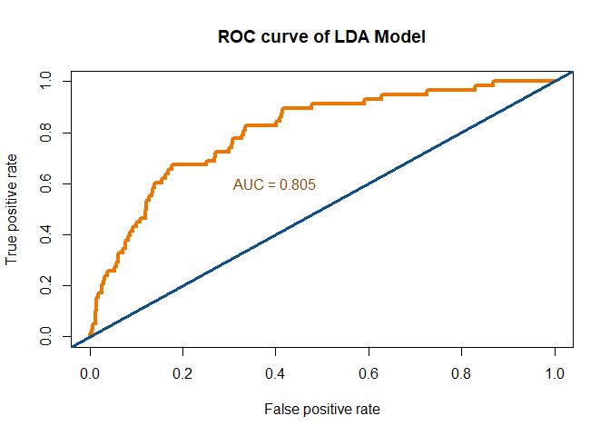
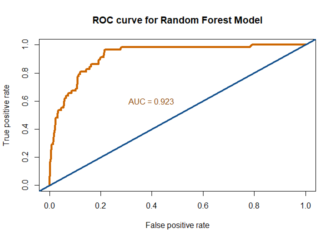

### a. Logistic Regression Model with categorical variables


```r
library(dplyr)
library(data.table)
library(caret)
library(ROCR)

#Read the train and test data
train <- fread("https://raw.githubusercontent.com/VolodymyrOrlov/MSDS6372_Project2/master/data/bank-balanced-train.csv", stringsAsFactors = TRUE)
test <- fread("https://raw.githubusercontent.com/VolodymyrOrlov/MSDS6372_Project2/master/data/bank-test.csv", stringsAsFactors = TRUE)

#Remove first column:

trainLR <- train[,1:17]
testLR <- test[,1:17]

#Age: divide into 3 age groups
trainLR$adult <- ifelse(trainLR$age <= 35, 1, 0)
trainLR$middleaged <- ifelse(trainLR$age >= 36 & trainLR$age <= 60, 1, 0)
trainLR$elderly <- ifelse(trainLR$age > 60, 1, 0)
testLR$adult <- ifelse(testLR$age <= 35, 1, 0)
testLR$middleaged <- ifelse(testLR$age >= 36 & testLR$age <= 60, 1, 0)
testLR$elderly <- ifelse(testLR$age > 60, 1, 0)

#Balance: we will create new variables to indicate negative, positive and zero balance. 
trainLR$balance_pos <- ifelse(train$balance > 0 & train$balance <= 100, "0 to 100",
                       ifelse(train$balance > 100 & train$balance <= 500, "100 to 500",
                       ifelse(train$balance >500 & train$balance <= 2000, "500 to 2000",
                       ifelse(train$balance >2000 & train$balance <= 10000, "2000 to 10000",
                       ifelse(train$balance >10000, "more than 10000",
                       ifelse(train$balance <0, "Negative balance", "Zero balance"))))))
trainLR$balance_pos <- as.factor(trainLR$balance_pos)

testLR$balance_pos <- ifelse(test$balance > 0 & test$balance <= 100, "0 to 100",
                              ifelse(test$balance > 100 & test$balance <= 500, "100 to 500",
                                     ifelse(test$balance >500 & test$balance <= 2000, "500 to 2000",
                                            ifelse(test$balance >2000 & test$balance <= 10000, "2000 to 10000",
                                                   ifelse(test$balance >10000, "more than 10000",
                                                          ifelse(test$balance <0, "Negative balance", "Zero balance"))))))
testLR$balance_pos <- as.factor(testLR$balance_pos)

# Campaign: We will reduce to 4 levels
trainLR$campaign_cat <-  ifelse(trainLR$campaign == 1, "Campaign Level 1", ifelse(trainLR$campaign ==2, "Campaign Level 2", ifelse(trainLR$campaign==3, "Campaign Level 3", "Campaign Level 4")))
trainLR$campaign_cat <- as.factor(trainLR$campaign_cat)
testLR$campaign_cat <-  ifelse(testLR$campaign == 1, "Campaign Level 1", ifelse(testLR$campaign ==2, "Campaign Level 2", ifelse(testLR$campaign==3, "Campaign Level 3", "Campaign Level 4")))
testLR$campaign_cat <- as.factor(testLR$campaign_cat)

#pdays: add variable for Contacted/No contacted
trainLR$pdays_contacted <- ifelse(test$pdays != -1, 1, 0)
testLR$pdays_not_contacted <- ifelse(test$pdays == -1, 1, 0)

#Convert days to months and make it a categorical variable: 
trainLR$pmonths <- trainLR$pdays/30
trainLR$months_passed <- ifelse(trainLR$pmonths <0, "Not Contacted", ifelse(trainLR$pmonths >= 0 & trainLR$pmonths <=2, "1 or 2 months", ifelse(trainLR$pmonths >2 & trainLR$pmonths <=6, "3 to 6 months", "More than 6 months")))
trainLR$months_passed <- as.factor(trainLR$months_passed)
testLR$pmonths <- testLR$pdays/30
testLR$months_passed <- ifelse(testLR$pmonths <0, "Not Contacted", ifelse(testLR$pmonths >= 0 & testLR$pmonths <=2, "1 or 2 months", ifelse(testLR$pmonths >2 & testLR$pmonths <=6, "3 to 6 months", "More than 6 months")))
testLR$months_passed <- as.factor(testLR$months_passed)

#previous: we'll make this a categorical variable
trainLR$not_contacted <- ifelse(trainLR$previous == 0,1,0)
trainLR$contacted <- ifelse(trainLR$previous > 0 & trainLR$previous <=2, "1 or 2 previous contacts", ifelse(trainLR$previous >2, "More than 2 previous contacts", 0))
trainLR$contacted <- as.factor(trainLR$contacted)

testLR$not_contacted <- ifelse(testLR$previous == 0,1,0)
testLR$contacted <- ifelse(testLR$previous > 0 & testLR$previous <=2, "1 or 2 previous contacts", ifelse(testLR$previous >2, "More than 2 previous contacts", 0))
testLR$contacted <- as.factor(testLR$contacted)

#Drop unused variables
trainLR <- trainLR[,-c(1,6,10,13,14,15,24)]
testLR <- testLR[,-c(1,6,10,13,14,15,24)]

# Convert categorical to dummy variables
library(dummies)
trainLR <- dummy.data.frame(data = trainLR, names = c("job", "marital", "education","month", "poutcome","balance_pos", "campaign_cat", "months_passed", "contacted", "contact"))
trainLR$housing <- ifelse(trainLR$housing == "yes", 1, 0)
trainLR$loan <- ifelse(trainLR$loan == "yes", 1, 0)
trainLR$default <- ifelse(trainLR$default == "yes", 1, 0)
trainLR$y <- ifelse(trainLR$y == "yes", 1, 0)

testLR <- dummy.data.frame(data = testLR, names = c("job", "marital", "education","month", "poutcome","balance_pos", "campaign_cat", "months_passed", "contacted", "contact"))
testLR$housing <- ifelse(testLR$housing == "yes", 1, 0)
testLR$loan <- ifelse(testLR$loan == "yes", 1, 0)
testLR$default <- ifelse(testLR$default == "yes", 1, 0)
testLR$y <- ifelse(testLR$y == "yes", 1, 0)

#Use model selection from glmnet package
library(glmnet)
#Convert to matrices, as required by glmnet
xtrainLR <- data.matrix(trainLR[,c(1:42,44:66)])
ytrainLR <- data.matrix(trainLR[,43])

#Use cv fit to choose the model
cvLR <- cv.glmnet(xtrainLR, ytrainLR, family = "binomial", type.measure = "class", nlambda = 1000)

#Plot the CV fit lambda against number of parameters
plot(cvLR)
```

<!-- -->

```r
#Find out which parameters are included in the model with the lowest lambda
coef(cvLR, s = "lambda.min")
```

```
## 66 x 1 sparse Matrix of class "dgCMatrix"
##                                                   1
## (Intercept)                            -1.134923328
## jobadmin.                               .          
## jobblue-collar                         -0.166562895
## jobentrepreneur                         .          
## jobhousemaid                           -0.133443311
## jobmanagement                           .          
## jobretired                              .          
## jobself-employed                        .          
## jobservices                             .          
## jobstudent                              0.241007323
## jobtechnician                           .          
## jobunemployed                           .          
## jobunknown                              .          
## maritaldivorced                         .          
## maritalmarried                         -0.096662090
## maritalsingle                           .          
## educationprimary                       -0.027992937
## educationsecondary                      .          
## educationtertiary                       0.021608402
## educationunknown                        .          
## default                                 .          
## housing                                -0.533439356
## loan                                   -0.194112172
## contactcellular                         0.028128931
## contacttelephone                        .          
## contactunknown                         -0.922758093
## monthapr                                0.468406701
## monthaug                                .          
## monthdec                                0.128710633
## monthfeb                                0.180372053
## monthjan                               -0.140494075
## monthjul                               -0.227714185
## monthjun                                0.182302007
## monthmar                                1.749202246
## monthmay                               -0.160708404
## monthnov                               -0.146299432
## monthoct                                1.093587053
## monthsep                                1.227490561
## duration                                0.004576592
## poutcomefailure                         .          
## poutcomeother                           .          
## poutcomesuccess                         1.784396905
## poutcomeunknown                        -0.272449857
## adult                                   .          
## middleaged                             -0.243865933
## elderly                                 0.618366350
## balance_pos0 to 100                     .          
## balance_pos100 to 500                   .          
## balance_pos2000 to 10000                0.016376053
## balance_pos500 to 2000                  .          
## balance_posmore than 10000              .          
## balance_posNegative balance            -0.274625583
## balance_posZero balance                -0.052687969
## campaign_catCampaign Level 1            0.215386138
## campaign_catCampaign Level 2            .          
## campaign_catCampaign Level 3            .          
## campaign_catCampaign Level 4           -0.218679971
## pdays_contacted                         .          
## months_passed1 or 2 months              .          
## months_passed3 to 6 months              0.394395868
## months_passedMore than 6 months         .          
## months_passedNot Contacted              .          
## not_contacted                           .          
## contacted0                              .          
## contacted1 or 2 previous contacts       .          
## contactedMore than 2 previous contacts  .
```

```r
#Get the predictions for the logistic model
LRtrain.class <- predict(cvLR, newx = xtrainLR, type = "class")

#Compare the prediction to the real outcome
table(LRtrain.class, trainLR$y)
```

```
##              
## LRtrain.class    0    1
##             0 2130  504
##             1  370 1996
```

```r
#Prediction on the test set
#Convert to matrices
xtestLR <- as.matrix(testLR[,c(1:42,44:66)])
ytestLR <- as.matrix(testLR[,43])

#Run model from training set on test set
LRtest.class <- predict(cvLR, newx = xtestLR, type = "class")
LRtest.prob <- predict(cvLR, newx = xtestLR, type = "response")

#Confusion matrix
table(LRtest.class, testLR$y)
```

```
##             
## LRtest.class   0   1
##            0 813  12
##            1 129  46
```

```r
#ROC curves
LRtest.pred <- prediction(LRtest.prob[,1], ytestLR)
roc.LRtest.perf = performance(LRtest.pred, measure = "tpr", x.measure = "fpr")
auc.test <- performance(LRtest.pred, measure = "auc")
auc.test <- auc.test@y.values
plot(roc.LRtest.perf, col = "darkorange2", lwd = 4, axes = FALSE, main = "ROC curve for Logistic Regression Model")
abline(a=0, b= 1, col = "dodgerblue4", lwd = 3)
text(x = .40, y = .6,paste("AUC = ", round(auc.test[[1]],4), sep = ""), col = "darkorange4")
```

<!-- -->

### B. Linear discriminant analysis

You can also embed plots, for example:


```r
#LDA model

#Extracting the continuous variables from the model
trainLDA <- train[,c(1,6,12,13,14,15,17)]

#Scaling the responses (z-score or Min-max normalization are available, I chose z-value)

trainLDA <- as.data.frame(scale(trainLDA[,-7]))
trainLDA$y <- train$y

#Creating the LDA model
library(MASS)
LDA <- lda(y ~ ., data = trainLDA)

# Predicting on the train set
predLDAtrain <- predict(LDA, trainLDA)
#Confusion matrix
table(predLDAtrain$class, trainLDA$y)
```

```
##      
##         no  yes
##   no  2059  854
##   yes  441 1646
```

```r
#Model testing
testLDA <- test[,c(1,6,12,13,14,15,17)]
testLDA <- as.data.frame(scale(testLDA[,-7]))
testLDA$y <- test$y
LDA.results <- predict( LDA, testLDA )

# Results - Confusion Matrix
t = table( LDA.results$class, test$y )
print( confusionMatrix( t ) )
```

```
## Confusion Matrix and Statistics
## 
##      
##        no yes
##   no  599  10
##   yes 343  48
##                                           
##                Accuracy : 0.647           
##                  95% CI : (0.6165, 0.6767)
##     No Information Rate : 0.942           
##     P-Value [Acc > NIR] : 1               
##                                           
##                   Kappa : 0.1255          
##  Mcnemar's Test P-Value : <2e-16          
##                                           
##             Sensitivity : 0.6359          
##             Specificity : 0.8276          
##          Pos Pred Value : 0.9836          
##          Neg Pred Value : 0.1228          
##              Prevalence : 0.9420          
##          Detection Rate : 0.5990          
##    Detection Prevalence : 0.6090          
##       Balanced Accuracy : 0.7317          
##                                           
##        'Positive' Class : no              
## 
```

```r
#ROC curves
preds <-LDA.results$posterior
preds <- as.data.frame(preds)
pred <- prediction(preds[,2],testLDA$y)
roc.perf = performance(pred, measure = "tpr", x.measure = "fpr")
auc.test <- performance(pred, measure = "auc")
auc.test <- auc.test@y.values
plot(roc.perf, main = "ROC curve of LDA Model", col = "darkorange2", lwd = 4)
abline(a=0, b= 1, col = "dodgerblue4", lwd = 3)
text(x = .40, y = .6,paste("AUC = ", round(auc.test[[1]],3), sep = ""), col = "darkorange4")
```

<!-- -->

### c. Random Forest


```r
# Implementing the random Forest

#Modify some variable names
library(randomForest)
trainRF <- fread("https://raw.githubusercontent.com/VolodymyrOrlov/MSDS6372_Project2/master/data/bank-balanced-train-d.csv")
trainRF$contacted <- ifelse(trainRF$pdays ==-1, 0,1)
trainRF$job_blue_collar <- trainRF$`job_blue-collar`
trainRF$job_self_employed <- trainRF$`job_self-employed`
trainRF <- trainRF[,-c(3,8)]
trainRF$y <- as.factor(ifelse(trainRF$y==1, "yes", "no"))

testRF <- fread("https://raw.githubusercontent.com/VolodymyrOrlov/MSDS6372_Project2/master/data/bank-test-d.csv")
testRF$contacted <- ifelse(testRF$pdays ==-1, 0,1)
testRF$job_blue_collar <- testRF$`job_blue-collar`
testRF$job_self_employed <- testRF$`job_self-employed`
testRF <- testRF[,-c(3,8)]
testRF$y <- as.factor(ifelse(testRF$y==1, "yes", "no"))

#Train the model
RF1 <- randomForest(y ~ ., data = trainRF, importance = TRUE)

#Confusion matrix
table(RF1$predicted, trainRF$y)
```

```
##      
##         no  yes
##   no  2062  279
##   yes  438 2221
```

```r
#Show which variables are important
importance(RF1)
```

```
##                              no         yes MeanDecreaseAccuracy
## day                  26.0806189   4.6499030         2.542155e+01
## job_admin.            0.7895398  -1.2539908        -3.551731e-01
## job_entrepreneur     -3.4093954  -0.2140627        -2.531197e+00
## job_housemaid         1.4406019   3.6035218         3.758654e+00
## job_management        5.2967741   1.6732124         5.132164e+00
## job_retired           4.9667439   5.9170543         8.544873e+00
## job_services         -1.2014381  -2.6133907        -2.762198e+00
## job_student           5.1220668   4.5094004         6.857540e+00
## job_technician        0.6980102   4.1081782         3.382691e+00
## job_unemployed       -0.3251848  -0.8739377        -8.631498e-01
## job_unknown          -0.6617215  -1.9273764        -1.864354e+00
## marital_divorced      0.8758650   2.0103902         2.065419e+00
## marital_married       3.3456991   3.9031246         5.662222e+00
## marital_single        2.0526421   6.7087454         6.974451e+00
## education_primary     0.5963795   6.1649479         5.236565e+00
## education_secondary   2.3904674   2.6877211         3.813281e+00
## education_tertiary    2.4960142   4.4404711         5.259307e+00
## education_unknown     1.0986439   0.8712588         1.359844e+00
## default_no           -2.3302031   3.2605585         1.378393e+00
## default_yes          -3.1631439   2.4884514         5.942121e-04
## housing_no           16.9367937  17.2304165         2.119223e+01
## housing_yes          17.1073817  16.8820349         2.092771e+01
## loan_no               2.4238608  12.0796709         1.095456e+01
## loan_yes              0.4879796  11.3739336         9.841877e+00
## contact_cellular     18.7042689  11.1105313         2.046768e+01
## contact_telephone     2.0914284   6.6545048         7.486662e+00
## contact_unknown      26.4068876  12.9470948         2.849488e+01
## month_apr            25.7849928  21.5665767         3.114961e+01
## month_aug            26.6885348  -2.5887836         2.491586e+01
## month_dec             6.0867373  -1.4751035         3.611988e+00
## month_feb            19.4507812   5.3362639         2.009166e+01
## month_jan            17.9783277  -7.0193117         1.193078e+01
## month_jul            20.6491583   4.4478737         1.973618e+01
## month_jun            23.2853282  -0.5087738         2.404889e+01
## month_mar            22.7319957  33.2865920         3.480342e+01
## month_may            19.7414304   5.4724928         2.037353e+01
## month_nov            21.2895706  -6.7874133         1.776466e+01
## month_oct            29.5604130  15.5096000         3.054432e+01
## month_sep            21.2804552  11.6441620         2.338294e+01
## poutcome_failure     15.4385371 -10.6073877         9.803150e+00
## poutcome_other        6.7112362  -5.2050789         3.167509e+00
## poutcome_success     16.3777250  33.8688850         2.981903e+01
## poutcome_unknown     12.6131376   8.5079522         1.296455e+01
## age                  20.4105897  19.1530329         2.784626e+01
## balance               9.9298523  12.6431098         1.585412e+01
## duration            118.6158727 139.2753476         1.436032e+02
## campaign             10.6271812   7.0920987         1.328684e+01
## pdays                22.7152261  10.7034882         2.267479e+01
## previous             12.4347135  10.0958432         1.380849e+01
## contacted            11.6247591   8.3737601         1.272369e+01
## job_blue_collar       2.1164062  11.8925649         1.152890e+01
## job_self_employed     2.3900216  -0.6143500         1.218898e+00
##                     MeanDecreaseGini
## day                       131.275925
## job_admin.                 17.793917
## job_entrepreneur            8.096942
## job_housemaid               6.935036
## job_management             19.487617
## job_retired                11.466356
## job_services               12.668912
## job_student                 8.264480
## job_technician             19.843690
## job_unemployed              7.802502
## job_unknown                 1.329143
## marital_divorced           14.420689
## marital_married            23.224726
## marital_single             19.914556
## education_primary          14.491421
## education_secondary        21.264240
## education_tertiary         20.567329
## education_unknown           8.763304
## default_no                  3.212921
## default_yes                 3.332103
## housing_no                 38.426052
## housing_yes                38.888541
## loan_no                    16.668744
## loan_yes                   16.088197
## contact_cellular           35.928895
## contact_telephone           9.908673
## contact_unknown            59.973852
## month_apr                  33.023821
## month_aug                  26.384072
## month_dec                   2.982796
## month_feb                  21.573846
## month_jan                  12.278500
## month_jul                  23.400568
## month_jun                  22.299132
## month_mar                  28.847529
## month_may                  30.225712
## month_nov                  20.228968
## month_oct                  26.367136
## month_sep                  18.415754
## poutcome_failure           16.202106
## poutcome_other              7.107964
## poutcome_success           74.080195
## poutcome_unknown           25.783845
## age                       156.564750
## balance                   163.466583
## duration                  767.907935
## campaign                   72.833065
## pdays                      81.739708
## previous                   47.351463
## contacted                  23.473220
## job_blue_collar            22.896816
## job_self_employed           8.108618
```

```r
#Test the model
predRFtest <- predict(RF1, newdata = testRF)

#Confusion matrix
table(predRFtest, testRF$y)
```

```
##           
## predRFtest  no yes
##        no  780   7
##        yes 162  51
```

```r
#Create ROC curve
fit.pred<-predict(RF1,newdata=testRF,type="prob")
pred <- prediction(fit.pred[,2], testRF$y)
roc.perf = performance(pred, measure = "tpr", x.measure = "fpr")
auc.test <- performance(pred, measure = "auc")
auc.test <- auc.test@y.values
plot(roc.perf, main = "ROC curve for Random Forest Model", col = "darkorange3", lwd = 4)
abline(a=0, b= 1, col = "dodgerblue4", lwd = 3)
text(x = .40, y = .6,paste("AUC = ", round(auc.test[[1]],3), sep = ""), col = "darkorange4")
```

<!-- -->
